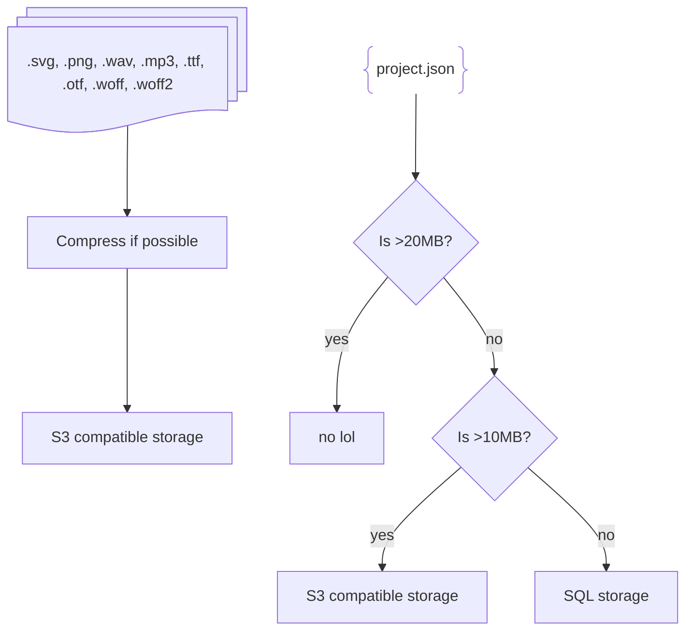

# aw3

aw3 is the software behind (almost) everything on the main AmpMod website. We gave it that strange name
because this is the 3rd attempt at making an AmpMod website. The first attempt was [this sloppily thrown
together PHP server](https://codeberg.org/ampmod/UBWeb) and the second was ampmod-web, which went well until
the git history was ruined and poor decisions started to be made after we added a new contributor.

Stack:

- SvelteKit
- TypeScript

## What aw3 does

- Store projects and their assets
- Host pages for projects and users
- Host pages about AmpMod
- Provide APIs for the above
- Administrating the aw3 instance

### What aw3 won't do in the near future

- Commenting on projects (it most likely never will - it's a nightmare to moderate for a small community with
  only a few admins)
- Forums, wiki, manual, extension gallery (hosted separately)
- Editor (we have links to paths such as `/projects/editor` and `/settings/addons` but we expect you to reverse
  proxy those - see below)

### What we plan for aw3 to do

- Studios

## Dev setup

```
pnpm install
pnpm dev
```

### Database additional step

To run the database, you will need Docker. Then, you can run `docker compose up` in the root of your copy
of aw3.

## Running in production

First, you will want to run `pnpm run build`.

Then, to serve the frontend, run `node ./build`. To set up the database, run the command above.

For the official AmpMod server, we use Docker and a Woodpecker CI workflow that builds aw3 as a container
that can run on the server painlessly.

## Setting up editor links

To set up links to AmpMod itself, such as `/projects/editor`, you need to use a reverse proxy to route those
paths to AmpMod. aw3 previously hosted these routes by itself, but it was a bit clunky so we now expect
that you do it yourself.

## How projects are stored



## Licensing

aw3 is licenced under the AGPLv3 or at your option, any later version. See `COPYING` for more information.

Some files are taken from ampmod-web-front under the MIT licence, and the ampmod gui package under the GPLv3.

aw3's developers do not copyright any files uploaded to any server hosting aw3.