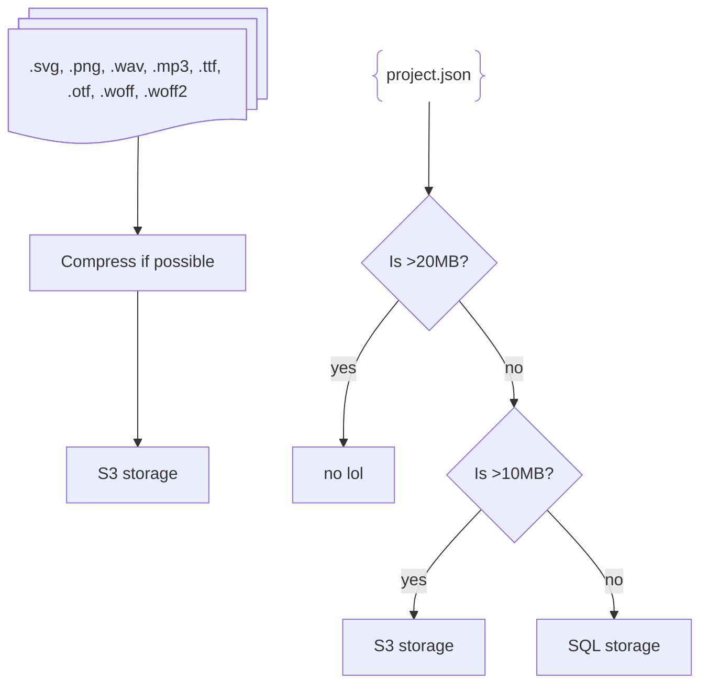

# aw3

aw3 is the software behind (almost) everything on the main AmpMod website. We gave it the name of an alien
because this is the 3rd attempt at making an AmpMod website. The first attempt was [this sloppily thrown
together PHP server](https://codeberg.org/ampmod/UBWeb) and the second was ampmod-web, which went well until
the git history was ruined and poor decisions started to be made after we added a new contributor.

Stack:

- SvelteKit
- TypeScript
- Bun

## What aw3 does

- Store projects and their assets
- Host pages for projects and users
- Host pages about AmpMod
- Provide APIs for the above
- Administrating the aw3 instance

### What aw3 won't do in the near future

- Commenting on projects (it most likely never will - it's a nightmare to moderate for a small community with
  only a few admins)
- Forums, wiki, manual, extension gallery (hosted separately)

### What we plan for aw3 to do

- Studios

## Setup

> [!IMPORTANT]
> To setup aw3 you will need to install Bun: https://bun.com/docs/installation. aw3 uses Bun as the package
> manager and as the server. Using Node to run the server will not work.

```
bun install
bun dev
```

### Database additional step

To run the database, you will need Docker. Then, you can run `docker compose up` in the root of your copy
of aw3.

## Running in production

First, you will want to run `bun run build`. Do not omit the `run` else Bun's own builder will be used instead
of Vite.

Then, to serve the frontend, run `bun run ./build/index.js`. To set up the database, run the command above.

## How projects are stored



## Licensing

aw3 is licenced under the AGPLv3 or at your option, any later version. See `COPYING` for more information.

Some files are taken from ampmod-web-front under the MIT licence, and the ampmod gui package under the GPLv3.
